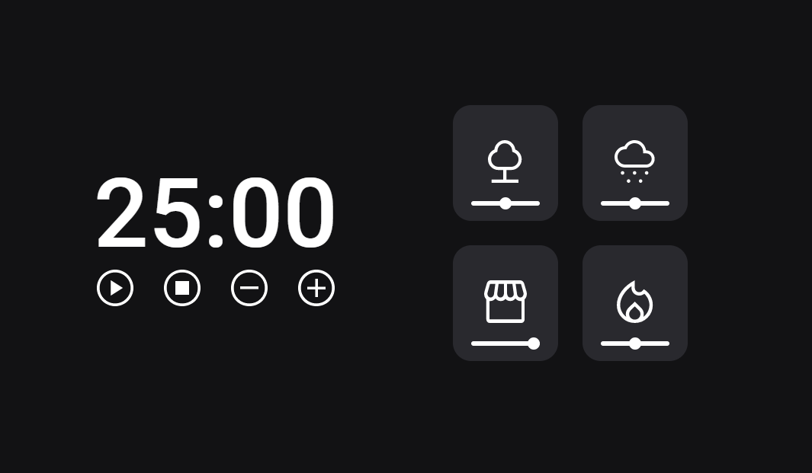

# Focus Timer 3.0 Dark Theme

> Turma Explorer 2.0

Projeto do desafio 2 do Focus Timer da RocketSeat onde aprendemos sobre Javascript modular e um pouco mais sobre reestruturação do código.

[🔗 Clique aqui para acessar](https://rildojunior.github.io/focus-timer3.0/)

## 🛠️ Tecnologias

- HTML
- CSS
- Javascript
- ES6 Module

## ✉️ Contato

rildojuniorcontato@gmail.com
